```{r setup, include=FALSE}
knitr::opts_chunk$set(echo = FALSE)

library(knitr)
library(sf)
library(ggplot2)
library(dplyr)
library(geodata)
library(viridis)
library(ggrepel)
```

## My favourite animal!

```{r, out.width = "100%", fig.align='center'}
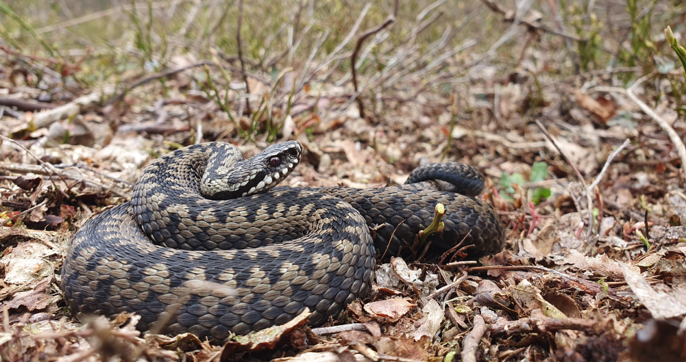
```

## The zig-zag OG

```{r, out.width = "90%", fig.align='center'}
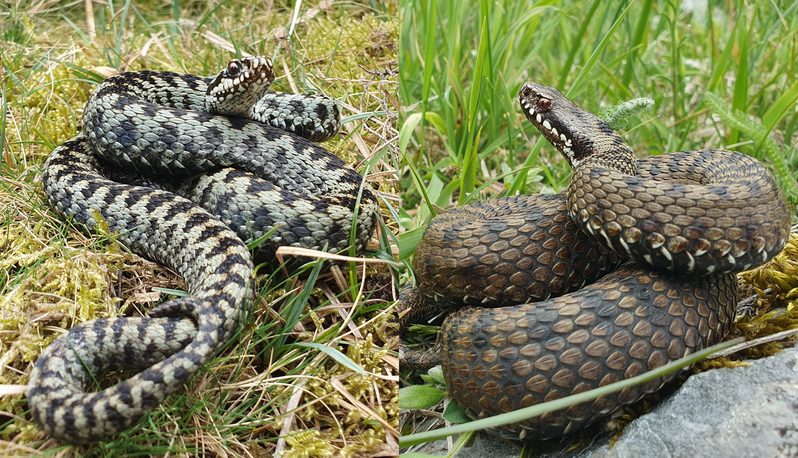
```

## Ultimate goth viper

```{r, out.width = "100%", fig.align='center'}
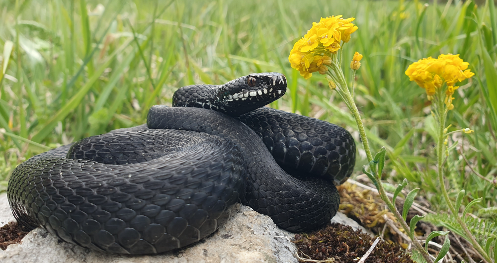
```

## Nature's chemical weapons system

```{r, out.width = "100%", fig.align='center'}
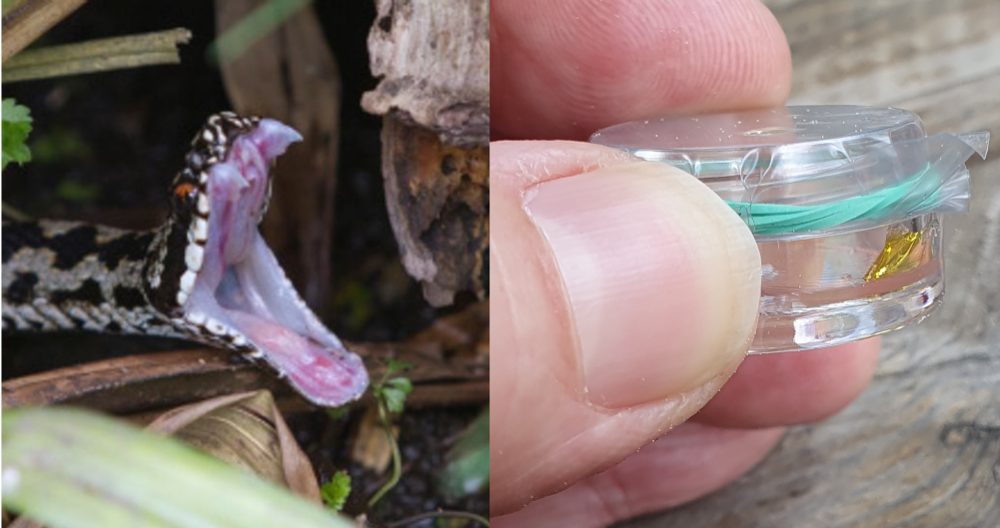
```

## Geographic distribution

```{r, out.width = "100%", fig.align='center'}
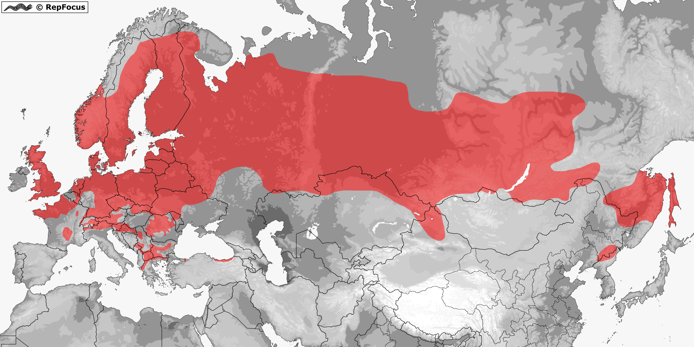
```

## Arctic viper

```{r, out.width = "100%", fig.align='center'}
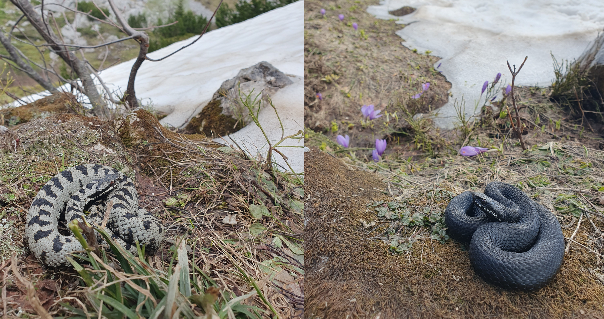
```

## Adders at risk {.columns-2}

- Major decline since 1950s
- Most populations < 20 adults
- Most populations are in decline
- Recent UK redlist 

```{r, out.width = "70%", fig.align='center'}
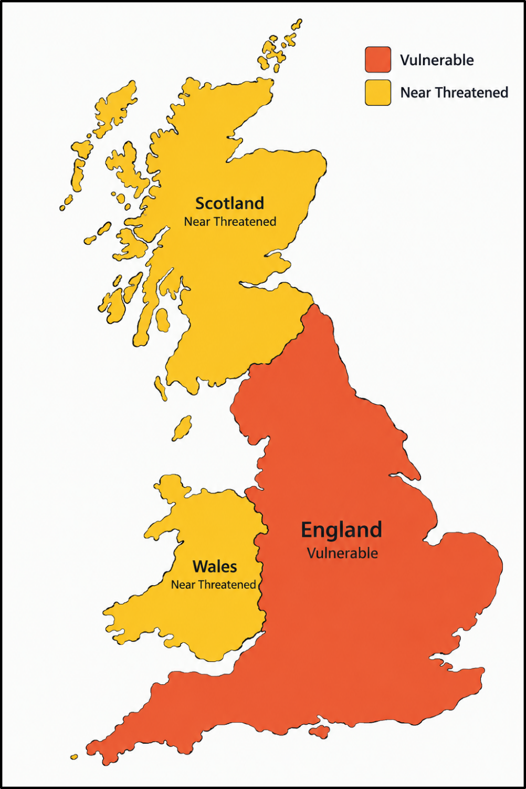
```

## Population fragmentation and bottlenecks {.white-slide}

```{r, out.width = "100%", fig.align='center'}
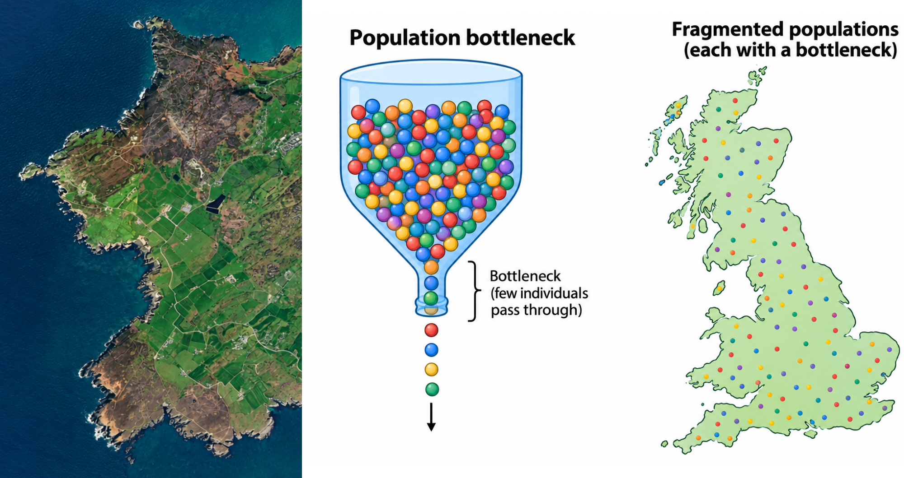
```

## Genetic variation {.white-slide}

```{r, out.width = "65%", fig.align='center'}
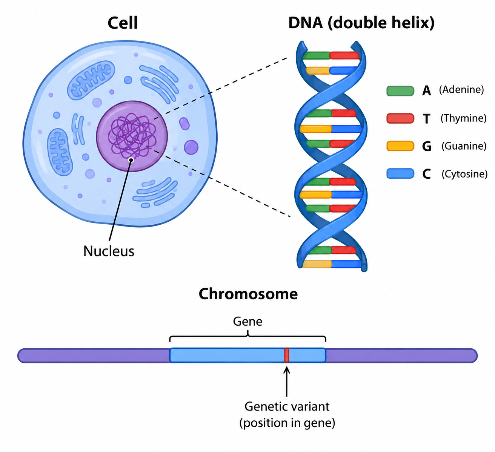
```

## Genetic variation {.white-slide}

```{r, out.width = "100%", fig.align='center'}
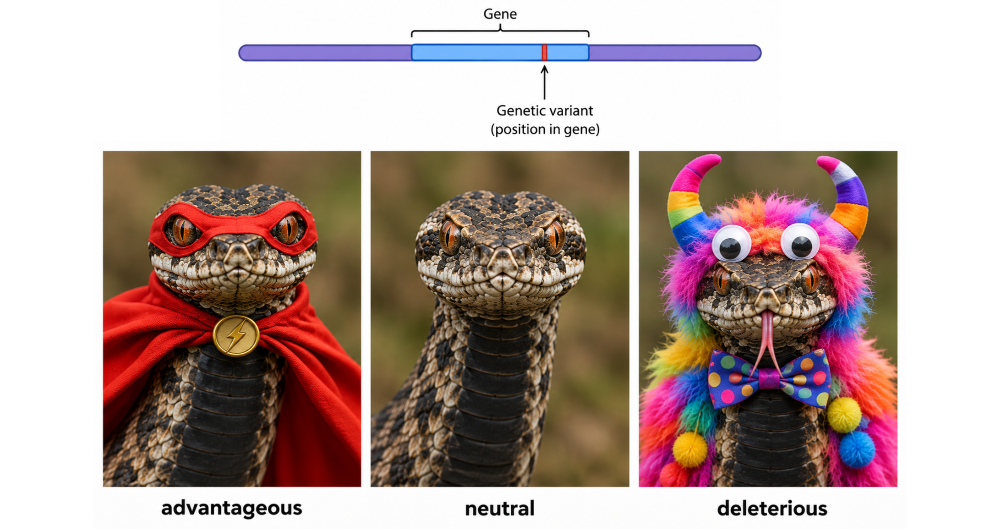
```

## Effect of bottlenecks on genetic variation {.white-slide}

```{r, out.width = "100%", fig.align='center'}
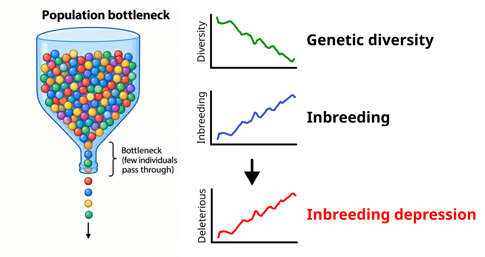
```

## Inbreeding depression {.white-slide}

```{r, out.width = "100%", fig.align='center'}
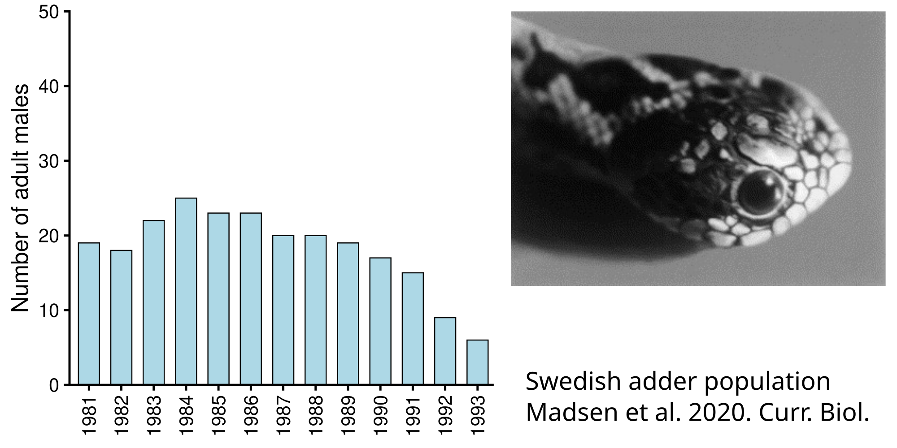
```

## Adder genetics at Bangor  {.white-slide}

```{r, out.width = "85%", fig.align='center'}
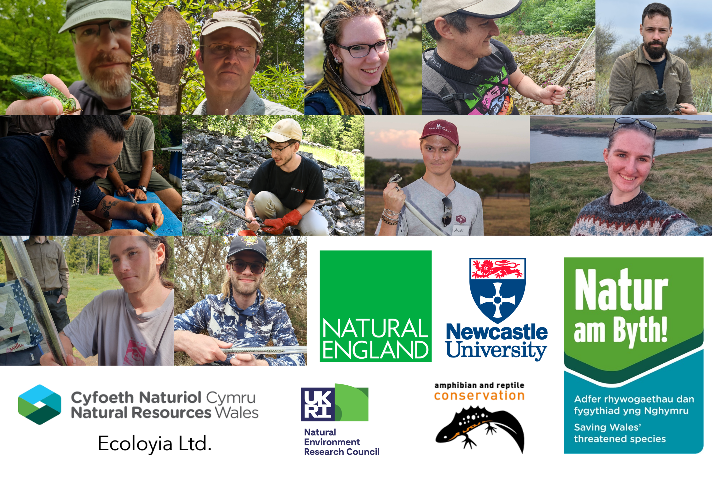
```

## Our mission {.columns-2 .white-slide}

- Can we identify the most at-risk populations?
- Is this a recent change?
- Are there any signs of inbreeding depression?
- What do we do about it?

```{r, out.width = "70%", fig.align='center'}
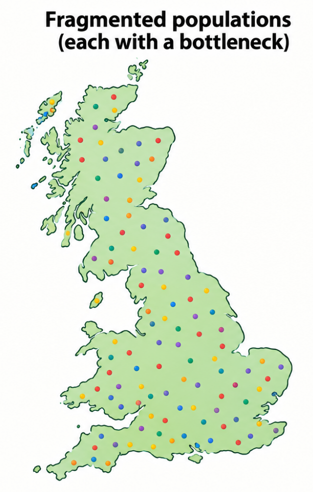
```

## Whole genome sequencing

```{r, out.width = "100%", fig.align='center'}
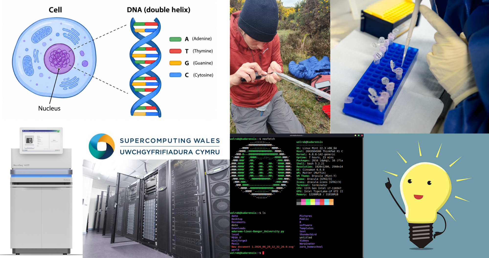
```

## National assessment of genetic diversity {.white-slide .flex-cols}

```{r, out.width = "160%", fig.width = 3, fig.align='left'}
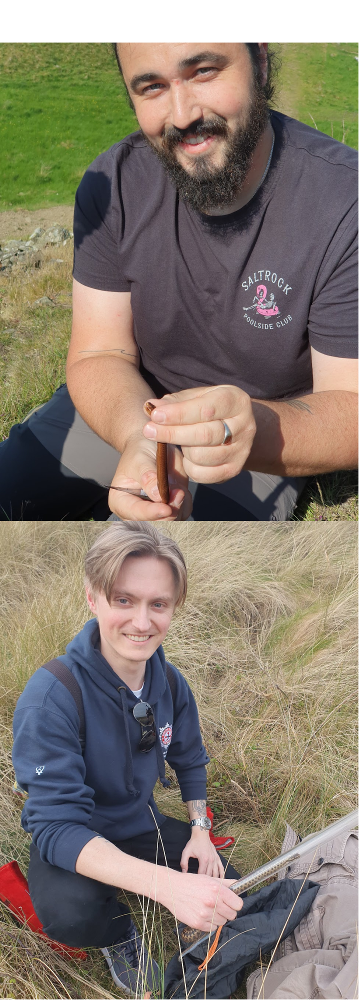
```

```{r, out.width = "70%", fig.width = 5, dpi = 600, fig.align = "center", echo = FALSE, fig.cap="", message=FALSE, warning=FALSE}
samples <- read.table("./data/data_summary.txt", header=TRUE)

# Get UK country boundaries
uk <- geodata::gadm(
  country = "GBR",
  level = 1,
  path = "./data/"
)

uk <- sf::st_as_sf(uk)

# Extract Wales 
wales <- uk %>%
  filter(NAME_1 == "Wales")

# Convert samples to spatial
samples_sf <- st_as_sf(
  samples,
  coords = c("longitude", "latitude"),
  crs = 4326
)

# Plot
p <- ggplot() +
  
  # Wales outline
  geom_sf(
    data = wales,
    fill = "grey95",
    colour = "black",
    linewidth = 0.6
  ) +
  
  # Sample locations
  geom_sf(
    data = samples_sf,
    aes(
      colour = het,
      size = froh
    ),
    alpha = 0.9
  ) +
  
  # Viridis colour scale
  scale_colour_viridis_c(
    option = "viridis",
    name = "Genetic diversity"
  ) +
  
  # FROH controls point size
  scale_size_continuous(
    range = c(2, 7),
    name = "Inbreeding level"
  ) +
  
# Map extent: whole of Wales
coord_sf(
  xlim = c(-5.8, -2.5),
  ylim = c(51.2, 53.6),
  expand = FALSE
) +

# Clean theme
theme_void() +
  theme(
    legend.position = "right"
  )

print(p)
```

## Museum genomics to travel back in time

```{r, out.width = "100%", fig.align='center'}
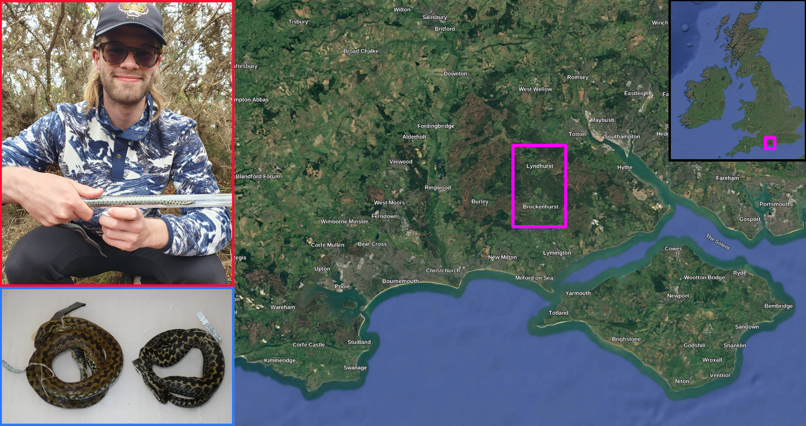
```

## Loss of genetic diversity over the past Century {.columns-2 .white-slide}

```{r, out.width = "100%", fig.height=4, fig.width = 4, dpi = 600, fig.align = "center", echo = FALSE, fig.cap="", message=FALSE, warning=FALSE}
mod_het <- c(0.7014444,0.6704119,0.7081891,0.7153177,0.718859,0.7094073,0.6150383,0.7844481,0.7881886)
his_het <- c(0.8407161,0.9411581,0.8463685,0.5174551,0.9137242,0.9716276,0.9452304,0.8909762,0.9176258)

par(mar = c(3,4,1,1), xpd=TRUE)
boxplot(his_het, mod_het, axes=FALSE, frame.plot=TRUE, ylab = "Genetic diversity", col=c("#2879ffff", "#ff0c30ff"))
axis(1, at=c(1,2), labels=c("Historic", "Modern"))
axis(2)

```

```{r, out.width = "100%", fig.height=4, fig.width = 4, dpi = 600, fig.align = "center", echo = FALSE, fig.cap="", message=FALSE, warning=FALSE}
mod_froh <- c(0.404838,0.4365595,0.4161844,0.3961553,0.4018285,0.4000988,0.5015937,0.3959823,0.4012058)
his_froh <- c(0.406879,0.3555781,0.3785476,0.662934,0.3712831,0.3264856,0.3615626,0.3838749,0.3625658)

par(mar = c(3,4,1,1), xpd=TRUE)
boxplot(his_froh, mod_froh, axes=FALSE, frame.plot=TRUE, ylab = "Inbreeding level", col=c("#2879ffff", "#ff0c30ff"))
axis(1, at=c(1,2), labels=c("Historic", "Modern"))
axis(2)  

```

## Venom genes - loss of adaptive diversity?

```{r, out.width = "100%", fig.align='center'}
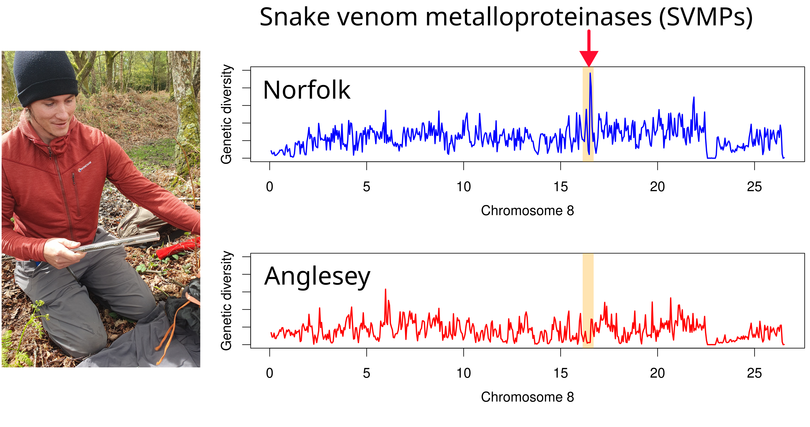
```

## Our mission {.columns-2 .white-slide}

- Can we identify the most at-risk populations?
- Is this a recent change?
- Are there any signs of inbreeding depression?
- **What do we do about it?**

```{r, out.width = "70%", fig.align='center'}

```

## Genetic rescue {.white-slide}

```{r, out.width = "100%", fig.align='center'}
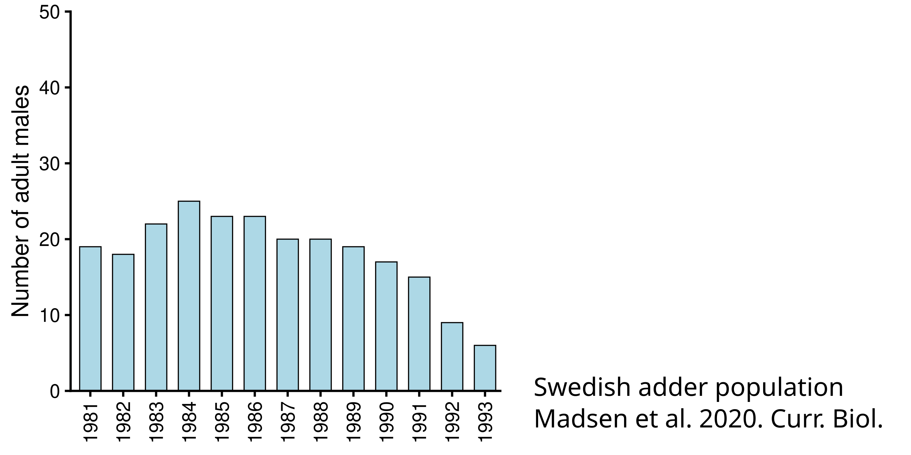
```

## Genetic rescue {.white-slide}

```{r, out.width = "100%", fig.align='center'}
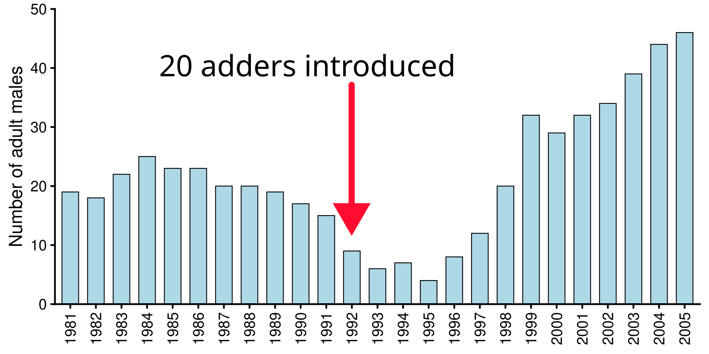
```

## Our mission {.columns-2 .white-slide}

- Can we identify the most at-risk populations?
- Is this a recent change?
- Are there any signs of inbreeding depression?
- **What do we do about it?**
  - Increase population size and connectivity
  - Conservation translocations increasingly part of the discussion

```{r, out.width = "70%", fig.align='center'}

```

---

```{r, out.width = "100%", fig.align='center'}
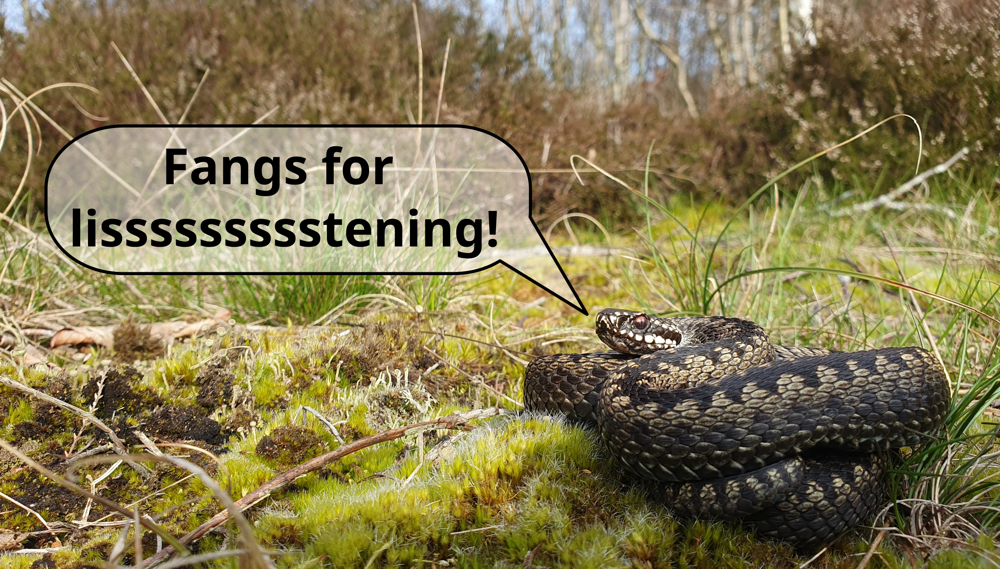
```
